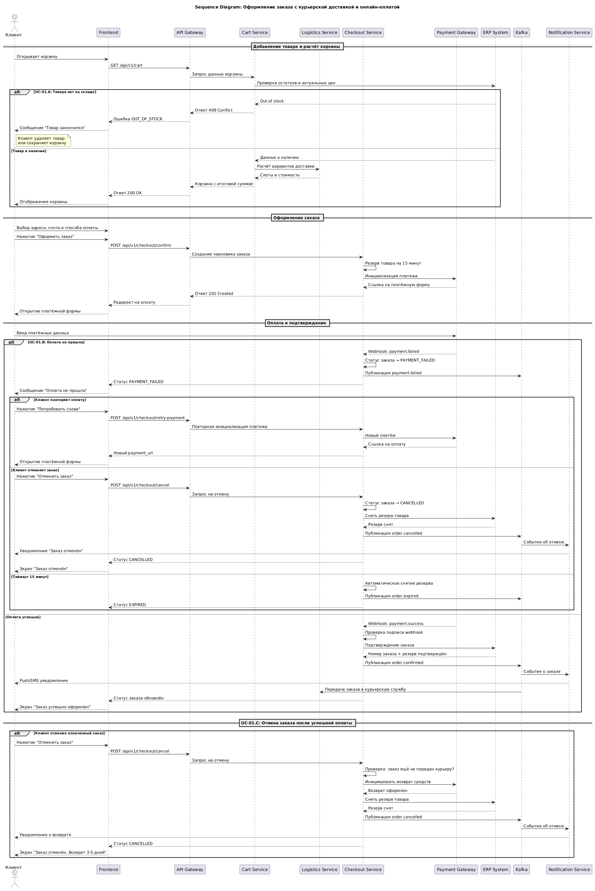

# Sequence-диаграмма: Оформление заказа с курьерской доставкой и онлайн-оплатой

Диаграмма описывает взаимодействие фронтенда, микросервисов, ERP-системы, платёжного шлюза и Kafka при оформлении заказа в e-commerce.

## Участники

| Участник | Роль |
|----------|------|
| **Клиент** | Пользователь мобильного приложения или сайта |
| **Frontend** | Мобильное приложение / веб-сайт |
| **API Gateway** | Единая точка входа для всех запросов |
| **Cart Service** | Микросервис корзины (хранение, валидация, расчёт) |
| **Logistics Service** | Микросервис расчёта доставки |
| **Checkout Service** | Микросервис оформления заказа |
| **Payment Gateway** | Внешний платёжный шлюз |
| **ERP System** | Система учёта заказов и остатков |
| **Kafka** | Брокер сообщений для асинхронного взаимодействия |
| **Notification Service** | Сервис push/SMS/email-уведомлений |

## Сценарии на диаграмме

### Основной сценарий: успешное оформление заказа

1. Клиент открывает корзину → Cart Service проверяет остатки в ERP и запрашивает расчёт доставки у Logistics Service.
2. Клиент выбирает адрес, слот и способ оплаты, нажимает «Оформить заказ».
3. Checkout Service создаёт черновик заказа, резервирует товар на 15 минут и инициирует платёж.
4. Payment Gateway возвращает ссылку на платёжную форму.
5. После успешной оплаты Payment Gateway отправляет webhook → Checkout Service подтверждает заказ в ERP → публикует событие `order.confirmed` в Kafka.
6. Notification Service уведомляет клиента, Logistics Service передаёт заказ в курьерскую службу.

### UC-01.A: Товара нет на складе

Если при проверке корзины ERP возвращает `out of stock`:
- Cart Service возвращает `409 Conflict`.
- Frontend показывает клиенту сообщение «Товар закончился».
- Клиент может удалить товар из корзины или сохранить её до появления товара.

### UC-01.B: Оплата не прошла

Если Payment Gateway отправляет `payment.failed`, Checkout Service переводит заказ в статус `PAYMENT_FAILED`. Далее возможны три исхода:

1. **Клиент повторяет оплату** — Checkout Service инициирует новый платёж, Payment Gateway возвращает новую ссылку.
2. **Клиент отменяет заказ** — резерв товара снимается, публикуется событие `order.cancelled`, клиент получает уведомление.
3. **Таймаут 15 минут** — если клиент не совершил никаких действий, резерв снимается автоматически, публикуется событие `order.expired`.

### UC-01.C: Отмена заказа после успешной оплаты

Отдельный сценарий, так как деньги уже списаны:
- Checkout Service проверяет, что заказ ещё не передан курьеру.
- Инициируется возврат средств через Payment Gateway.
- ERP снимает резерв товара.
- Публикуется событие `order.cancelled`.
- Клиент получает уведомление о возврате средств (3–5 рабочих дней).

## Ключевые технические решения

- **Синхронные вызовы:** Frontend → API Gateway → Cart Service → ERP / Logistics Service.
- **Асинхронные события:** Checkout Service → Kafka → Notification Service / Logistics Service.
- **Webhook:** Payment Gateway → Checkout Service (уведомление об оплате).
- **Идемпотентность:** ключ сообщения в Kafka — `order_id`, что защищает от дублей.
- **Резервирование:** 15 минут — оптимальный таймаут между созданием заказа и оплатой (баланс между конверсией и риском «зависших» резервов).
- **Обработка ошибок:** DLQ в Kafka для зависших событий, HTTP-коды 400/409/500 для API.

## Связанные артефакты

- 📋 [Use Cases](../use-cases.md)
- 🔌 [API-контракты](../api-contracts.md)
- 🗄️ [Модель данных](../db/schema.sql)
- 📐 Исходник диаграммы: [sequence-diagram.puml](sequence-diagram.puml)
